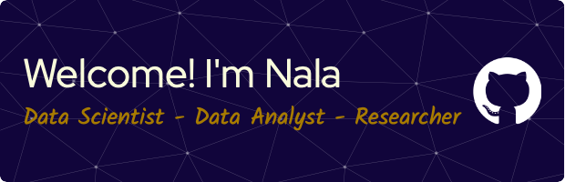

Always willing to learn, acquire experiences and develop the necessary skills to achieve objectives.
Interested in information management and the development of descriptive and predictive models; whether from structured or unstructured sources of data; whether internal or external to the organization; with the aim of generating information that allows providing the business with a vision and that allows the discovery of opportunities; in order to develop a long-term strategy focused on data and information.

Here you can find some of my projects carried out during my studies and learning.

I hope we can connect!

<h3 align="left">Connect with me:</h3>

<h3 align="left">Languages and Tools:</h3>

  

